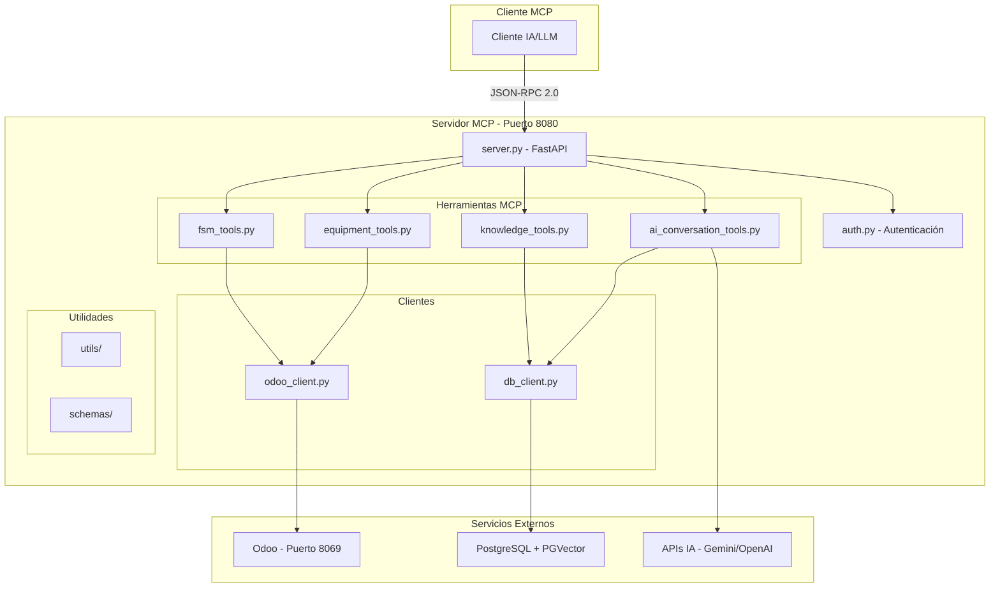

# 🚀 Guía de Implementación - Servidor MCP PATCO

## 📋 Resumen de la Implementación

Esta guía documenta la implementación completa del **Servidor MCP (Model Context Protocol)** para el proyecto PATCO, desarrollado como parte de la **Fase 4** del plan de automatización industrial.

### ✅ Estado de Implementación: **COMPLETADO**

---

## 🏗️ Arquitectura Implementada



---

## 📁 Estructura de Archivos Implementada

```
ai-services/mcp/
├── 📄 server.py                    # Servidor principal FastAPI con MCP
├── 📄 config.py                    # Configuración y variables de entorno
├── 📄 auth.py                      # Autenticación JWT y Odoo
├── 📄 odoo_client.py               # Cliente para API de Odoo
├── 📄 db_client.py                 # Cliente PostgreSQL con PGVector
├── 📄 Dockerfile                   # Imagen Docker del servidor
├── 📄 requirements.txt             # Dependencias Python
├── 📄 requirements-dev.txt         # Dependencias de desarrollo
├── 📄 .env.example                 # Plantilla de variables de entorno
├── 📄 .gitignore                   # Exclusiones de Git
├── 📄 README.md                    # Documentación principal
├── 📄 Makefile                     # Comandos de automatización
├── 📄 pytest.ini                  # Configuración de pytest
├── 📄 .pre-commit-config.yaml      # Hooks de pre-commit
│
├── 📁 tools/                       # Herramientas MCP
│   ├── 📄 __init__.py
│   ├── 📄 fsm_tools.py             # Herramientas FSM
│   ├── 📄 equipment_tools.py       # Herramientas de equipos
│   ├── 📄 knowledge_tools.py       # Herramientas RAG
│   └── 📄 ai_conversation_tools.py # Herramientas de conversaciones IA
│
├── 📁 schemas/                     # Esquemas de validación
│   ├── 📄 __init__.py
│   ├── 📄 mcp_schemas.py           # Esquemas MCP
│   ├── 📄 fsm_schemas.py           # Esquemas FSM
│   ├── 📄 equipment_schemas.py     # Esquemas de equipos
│   ├── 📄 knowledge_schemas.py     # Esquemas RAG
│   └── 📄 ai_conversation_schemas.py # Esquemas de conversaciones
│
├── 📁 utils/                       # Utilidades
│   ├── 📄 __init__.py
│   ├── 📄 auth_manager.py          # Gestión de autenticación
│   ├── 📄 database_client.py       # Cliente de base de datos
│   ├── 📄 logging_config.py        # Configuración de logging
│   ├── 📄 odoo_client.py           # Cliente Odoo
│   └── 📄 rate_limiter.py          # Limitador de velocidad
│
├── 📁 tests/                       # Suite de pruebas
│   ├── 📄 __init__.py
│   ├── 📄 conftest.py              # Configuración de pytest
│   ├── 📄 test_server.py           # Tests del servidor
│   ├── 📄 test_tools.py            # Tests de herramientas
│   ├── 📄 test_integration.py      # Tests de integración
│   └── 📄 test_utils.py            # Tests de utilidades
│
└── 📁 scripts/                     # Scripts de utilidad
    ├── 📄 validate_mcp_server.py   # Validación del servidor
    └── 📄 quick_start.py           # Inicio rápido
```

---

## 🛠️ Herramientas MCP Implementadas

### 1. **Herramientas FSM (Field Service Management)**
- `get_fsm_order`: Obtener información de órdenes de servicio
- `update_fsm_order`: Actualizar estado y datos de órdenes

### 2. **Herramientas de Equipos**
- `get_equipment_info`: Obtener información detallada de equipos

### 3. **Herramientas RAG (Retrieval-Augmented Generation)**
- `search_knowledge_base`: Búsqueda semántica en base de conocimiento

### 4. **Herramientas de Conversaciones IA**
- `create_ai_conversation`: Crear nueva conversación
- `send_ai_message`: Enviar mensaje a conversación
- `get_ai_conversation`: Obtener historial de conversación

---

## 🚀 Inicio Rápido

### Prerrequisitos
- Docker y Docker Compose
- Python 3.11+
- Variables de entorno configuradas

### 1. Configuración Inicial
```bash
# Copiar variables de entorno
cp ai-services/mcp/.env.example .env

# Editar variables según tu entorno
# Especialmente: GEMINI_API_KEY, OPENAI_API_KEY, JWT_SECRET_KEY
```

### 2. Despliegue con Docker Compose
```bash
# Iniciar servicios base (PostgreSQL + Odoo)
docker-compose up -d db odoo

# Esperar que los servicios estén listos (2-3 minutos)
docker-compose logs -f odoo

# Iniciar servidor MCP
docker-compose --profile ai-services up -d mcp-server
```

### 3. Verificación
```bash
# Verificar estado de servicios
docker-compose ps

# Verificar health check
curl http://localhost:8080/health

# Ejecutar validación completa
python ai-services/mcp/scripts/validate_mcp_server.py
```

### 4. Uso del Script de Inicio Rápido
```bash
# Instalación completa automatizada
python ai-services/mcp/scripts/quick_start.py setup

# Solo iniciar MCP (si dependencias ya están activas)
python ai-services/mcp/scripts/quick_start.py start

# Ver estado
python ai-services/mcp/scripts/quick_start.py status

# Ver ejemplos de uso
python ai-services/mcp/scripts/quick_start.py examples
```

---

## 🔧 Configuración Avanzada

### Variables de Entorno Clave
```bash
# Servidor MCP
MCP_HOST=0.0.0.0
MCP_PORT=8080
MCP_DEBUG=true

# Base de datos
DATABASE_URL=postgresql://odoo:P4tc0_2@db:5432/odoo_patco

# Odoo API
ODOO_URL=http://odoo:8069
ODOO_DB=odoo_patco
ODOO_USERNAME=admin
ODOO_PASSWORD=admin

# Autenticación
JWT_SECRET_KEY=tu-clave-secreta-aqui
JWT_ALGORITHM=HS256

# APIs IA
GEMINI_API_KEY=tu-api-key-gemini
OPENAI_API_KEY=tu-api-key-openai

# Embeddings
EMBEDDING_MODEL=text-embedding-004
EMBEDDING_DIMENSION=768
```

### Configuración de Rate Limiting
```bash
RATE_LIMIT_REQUESTS=100
RATE_LIMIT_WINDOW=60
```

### Configuración CORS
```bash
CORS_ORIGINS=http://localhost:3000,http://localhost:8069
```

---

## 📡 API y Endpoints

### Health Check
```http
GET http://localhost:8080/health
```

### Protocolo MCP (JSON-RPC 2.0)
```http
POST http://localhost:8080/mcp
Content-Type: application/json

{
  "jsonrpc": "2.0",
  "id": 1,
  "method": "tools/list",
  "params": {}
}
```

### Ejemplo: Obtener Orden FSM
```json
{
  "jsonrpc": "2.0",
  "id": 2,
  "method": "tools/call",
  "params": {
    "name": "get_fsm_order",
    "arguments": {
      "order_id": 1
    }
  }
}
```

---

## 🧪 Testing y Validación

### Ejecutar Tests
```bash
# Tests unitarios
make test-unit

# Tests de integración
make test-integration

# Cobertura completa
make test-coverage

# Tests de seguridad
make test-security
```

### Validación Manual
```bash
# Script de validación completa
python scripts/validate_mcp_server.py

# Verificar logs
docker-compose logs -f mcp-server
```

---

## 🔒 Seguridad

### Características Implementadas
- ✅ Autenticación JWT
- ✅ Rate limiting por IP
- ✅ Validación de esquemas
- ✅ Sanitización de inputs
- ✅ CORS configurado
- ✅ Headers de seguridad
- ✅ Logging de seguridad

### Mejores Prácticas
- Usar HTTPS en producción
- Rotar JWT secrets regularmente
- Monitorear logs de seguridad
- Actualizar dependencias

---

## 📊 Monitoreo y Observabilidad

### Métricas Disponibles
- Health checks automáticos
- Logs estructurados
- Métricas de rendimiento
- Estadísticas de rate limiting

### Logs
```bash
# Ver logs en tiempo real
docker-compose logs -f mcp-server

# Logs específicos de errores
docker-compose logs mcp-server | grep ERROR
```

---

## 🚨 Troubleshooting

### Problemas Comunes

#### 1. Servidor no inicia
```bash
# Verificar logs
docker-compose logs mcp-server

# Verificar variables de entorno
docker-compose exec mcp-server env | grep MCP
```

#### 2. Error de conexión a base de datos
```bash
# Verificar PostgreSQL
docker-compose exec db psql -U odoo -d odoo_patco -c "SELECT version();"

# Verificar PGVector
docker-compose exec db psql -U odoo -d odoo_patco -c "SELECT * FROM pg_available_extensions WHERE name = 'vector';"
```

#### 3. Error de autenticación con Odoo
```bash
# Verificar conectividad
curl http://localhost:8069/web/database/selector

# Verificar credenciales en .env
```

#### 4. APIs IA no funcionan
```bash
# Verificar API keys
echo $GEMINI_API_KEY
echo $OPENAI_API_KEY
```

---

## 🔄 Mantenimiento

### Comandos Útiles
```bash
# Reiniciar solo MCP
docker-compose restart mcp-server

# Reconstruir imagen
docker-compose build mcp-server

# Limpiar volúmenes
docker-compose down -v

# Ver uso de recursos
docker stats patco-mcp-server
```

### Actualizaciones
1. Hacer backup de configuración
2. Actualizar código
3. Reconstruir imagen
4. Ejecutar tests
5. Desplegar

---

## 📈 Próximos Pasos

### Mejoras Planificadas
- [ ] Métricas con Prometheus
- [ ] Dashboard con Grafana
- [ ] Autenticación OAuth2
- [ ] Cache distribuido con Redis
- [ ] Balanceador de carga
- [ ] Deployment en Kubernetes

### Integración con Otros Servicios
- [ ] Webhook notifications
- [ ] Message queues (RabbitMQ)
- [ ] File storage (MinIO)
- [ ] Search engine (Elasticsearch)

---

## 👥 Soporte y Contribución

### Contacto
- **Proyecto**: PATCO - Automatización Industrial
- **Fase**: 4 - Servidor MCP Básico
- **Estado**: ✅ Implementación Completa

### Documentación Adicional
- `README.md`: Documentación principal
- `api-docs/`: Documentación de API
- `tests/`: Ejemplos de uso
- `scripts/`: Herramientas de utilidad

---

## 📝 Changelog

### v1.0.0 - Enero 2025
- ✅ Implementación inicial completa
- ✅ Servidor MCP con FastAPI
- ✅ 7 herramientas MCP implementadas
- ✅ Autenticación JWT
- ✅ Integración con Odoo y PostgreSQL
- ✅ Suite completa de tests
- ✅ Docker y Docker Compose
- ✅ Scripts de validación y despliegue
- ✅ Documentación completa

---

**🎉 ¡Implementación de la Fase 4 completada exitosamente!**

El servidor MCP está listo para producción y proporciona una base sólida para las siguientes fases del proyecto de automatización industrial PATCO.