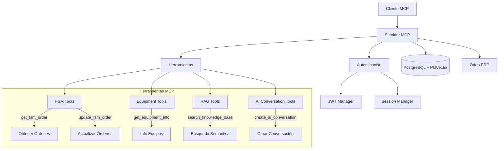

# 🚀 Servidor MCP (Model Context Protocol) - PATCO ERP

[](https://python.org)
[](https://fastapi.tiangolo.com)
[](https://postgresql.org)
[](https://docker.com)
[](LICENSE)

## 📋 Descripción

El **Servidor MCP** es un componente clave del ecosistema PATCO ERP que implementa el protocolo **Model Context Protocol (MCP)** para proporcionar acceso estructurado y seguro a las funcionalidades del sistema ERP a través de herramientas especializadas.

### 🎯 Características Principales

- **🔧 Protocolo MCP Completo**: Implementación completa del protocolo MCP con JSON-RPC 2.0
- **🛠️ Herramientas Especializadas**: FSM, Equipos, RAG y Conversaciones de IA
- **🔐 Autenticación Robusta**: Integración con Odoo y JWT para seguridad
- **📊 Base de Datos Vectorial**: Soporte para PGVector y búsquedas semánticas
- **⚡ Alto Rendimiento**: Rate limiting, caché y optimizaciones
- **🐳 Docker Ready**: Configuración completa para contenedores
- **📈 Monitoreo**: Métricas, health checks y logging estructurado
- **🧪 Testing Completo**: Suite de tests unitarios e integración

## 🏗️ Arquitectura



## 🚀 Inicio Rápido

### Prerrequisitos

- **Python 3.11+**
- **PostgreSQL 15+** con extensión PGVector
- **Docker & Docker Compose**
- **Odoo 18** (Community Edition)

## 📦 Instalación y Configuración

### Prerrequisitos

- **Python 3.11+**
- **PostgreSQL 15+** con extensión PGVector
- **Docker & Docker Compose**
- **Odoo 18** (Community Edition)

### 1. Configuración de Variables de Entorno

```bash
# Copiar archivo de configuración
cp .env.example .env

# Editar variables de entorno críticas
nano .env  # o tu editor preferido
```

**Variables Críticas a Configurar:**

```env
# Base de datos
DATABASE_URL=postgresql://odoo:P4tc0_2@db:5432/odoo_patco

# Odoo
ODOO_URL=http://odoo:8069
ODOO_DB=odoo_patco
ODOO_USERNAME=admin
ODOO_PASSWORD=admin

# JWT (cambiar en producción)
JWT_SECRET_KEY=patco-mcp-secret-key-2025

# APIs externas
GEMINI_API_KEY=tu-clave-gemini-api
```

### 2. Instalación con Docker (Recomendado)

```bash
# Construir imagen del servidor MCP
docker compose build mcp-server

# Ejecutar servidor MCP con perfil ai-services
docker compose --profile ai-services up mcp-server

# Verificar estado del servidor
docker compose ps mcp-server

# Ver logs del servidor
docker compose logs -f mcp-server
```

### 3. Instalación Local (Desarrollo)

```bash
# Crear entorno virtual
python -m venv venv
source venv/bin/activate  # Linux/Mac
# o
venv\Scripts\activate     # Windows

# Instalar dependencias
pip install -r requirements.txt

# Ejecutar servidor
python server.py
```

### 4. Verificación de la Instalación

```bash
# Health check
curl -f http://localhost:8080/health

# Listar herramientas disponibles
curl http://localhost:8080/tools

# Test de conectividad con Odoo
curl -X POST http://localhost:8080/mcp \
  -H "Content-Type: application/json" \
  -d '{
    "jsonrpc": "2.0",
    "method": "tools/call",
    "params": {
      "name": "get_fsm_order",
      "arguments": {"order_id": 1}
    },
    "id": 1
  }'
```
ODOO_USERNAME=admin
ODOO_PASSWORD=admin

# JWT
JWT_SECRET_KEY=tu-clave-secreta-muy-segura

# APIs Externas (opcional)
GEMINI_API_KEY=tu-api-key
OPENAI_API_KEY=tu-api-key
ANTHROPIC_API_KEY=tu-api-key
```

### 3. Ejecución con Docker

```bash
# Desde el directorio raíz del proyecto
docker-compose up -d

# Verificar que todos los servicios estén corriendo
docker-compose ps

# Ver logs del servidor MCP
docker-compose logs -f mcp-server
```

### 4. Ejecución en Desarrollo

```bash
# Activar entorno virtual
source venv/bin/activate

# Ejecutar servidor en modo desarrollo
make run
# o directamente:
python -m uvicorn server:app --host 0.0.0.0 --port 8080 --reload
```

### 5. Verificación

```bash
# Health check
curl http://localhost:8080/health

# Listar herramientas disponibles
curl -X POST http://localhost:8080/mcp \
  -H "Content-Type: application/json" \
  -d '{
    "jsonrpc": "2.0",
    "id": 1,
    "method": "tools/list"
  }'
```

## 🛠️ Herramientas MCP Disponibles

### 1. FSM (Field Service Management)

#### `get_fsm_order`
Obtiene información detallada de órdenes de servicio de campo.

```json
{
  "jsonrpc": "2.0",
  "id": 1,
  "method": "tools/call",
  "params": {
    "name": "get_fsm_order",
    "arguments": {
      "order_id": 123,
      "include_tasks": true,
      "include_materials": true
    }
  }
}
```

#### `update_fsm_order`
Actualiza el estado y información de órdenes de servicio.

```json
{
  "jsonrpc": "2.0",
  "id": 2,
  "method": "tools/call",
  "params": {
    "name": "update_fsm_order",
    "arguments": {
      "order_id": 123,
      "stage": "in_progress",
      "notes": "Trabajo iniciado",
      "completion_percentage": 25
    }
  }
}
```

### 2. Equipment (Gestión de Equipos)

#### `get_equipment_info`
Obtiene información completa de equipos y su historial.

```json
{
  "jsonrpc": "2.0",
  "id": 3,
  "method": "tools/call",
  "params": {
    "name": "get_equipment_info",
    "arguments": {
      "equipment_id": 456,
      "include_maintenance_history": true,
      "include_location": true
    }
  }
}
```

### 3. RAG (Retrieval Augmented Generation)

#### `search_knowledge_base`
Realiza búsquedas semánticas en la base de conocimiento.

```json
{
  "jsonrpc": "2.0",
  "id": 4,
  "method": "tools/call",
  "params": {
    "name": "search_knowledge_base",
    "arguments": {
      "query": "mantenimiento preventivo bomba centrífuga",
      "max_results": 10,
      "similarity_threshold": 0.7,
      "include_metadata": true
    }
  }
}
```

### 4. AI Conversations (Conversaciones de IA)

#### `create_ai_conversation`
Crea y gestiona conversaciones con modelos de IA.

```json
{
  "jsonrpc": "2.0",
  "id": 5,
  "method": "tools/call",
  "params": {
    "name": "create_ai_conversation",
    "arguments": {
      "user_id": 1,
      "message": "¿Cuál es el procedimiento para mantenimiento de bombas?",
      "context": {
        "equipment_id": 456,
        "order_id": 123
      },
      "model": "gemini-1.5-flash"
    }
  }
}
```

## 🔧 Desarrollo

### Estructura del Proyecto

```
ai-services/mcp/
├── 📁 schemas/              # Esquemas de validación Pydantic
│   ├── __init__.py
│   ├── base.py             # Esquemas base
│   ├── fsm.py              # Esquemas FSM
│   ├── equipment.py        # Esquemas de equipos
│   ├── knowledge.py        # Esquemas RAG
│   └── conversation.py     # Esquemas de conversaciones
├── 📁 tools/               # Herramientas MCP
│   ├── __init__.py
│   ├── fsm_tools.py        # Herramientas FSM
│   ├── equipment_tools.py  # Herramientas de equipos
│   ├── knowledge_tools.py  # Herramientas RAG
│   └── conversation_tools.py # Herramientas de IA
├── 📁 utils/               # Utilidades
│   ├── __init__.py
│   ├── auth.py             # Autenticación y autorización
│   ├── db_client.py        # Cliente PostgreSQL
│   ├── odoo_client.py      # Cliente Odoo
│   ├── logging_config.py   # Configuración de logging
│   └── rate_limiter.py     # Limitación de tasas
├── 📁 tests/               # Tests
│   ├── __init__.py
│   ├── conftest.py         # Configuración de pytest
│   ├── test_server.py      # Tests del servidor
│   ├── test_tools.py       # Tests de herramientas
│   ├── test_integration.py # Tests de integración
│   └── test_utils.py       # Tests de utilidades
├── 📁 scripts/             # Scripts de utilidad
│   ├── quick_start.py      # Script de inicio rápido
│   └── validate_mcp_server.py # Validación del servidor
├── 📄 server.py            # Servidor principal
├── 📄 config.py            # Configuración
├── 📄 requirements.txt     # Dependencias esenciales
├── 📄 requirements-dev.txt # Dependencias de desarrollo
├── 📄 Dockerfile           # Imagen Docker optimizada
├── 📄 Makefile            # Comandos de desarrollo
├── 📄 pytest.ini         # Configuración de pytest
├── 📄 .pre-commit-config.yaml # Hooks de pre-commit
├── 📄 .env.example        # Variables de entorno ejemplo
├── 📄 .gitignore          # Archivos ignorados por Git
└── 📄 README.md           # Esta documentación
```

### Comandos de Desarrollo

```bash
# Instalar dependencias
make install
make install-dev

# Ejecutar servidor
make run          # Desarrollo
make run-prod     # Producción

# Testing
make test         # Todos los tests
make test-unit    # Tests unitarios
make test-integration # Tests de integración
make test-cov     # Con cobertura
make test-watch   # Modo watch

# Calidad de código
make lint         # Linting
make format       # Formateo
make security     # Análisis de seguridad

# Docker
make docker-build # Construir imagen
make docker-run   # Ejecutar contenedor
make docker-logs  # Ver logs

# Utilidades
make clean        # Limpiar archivos temporales
make health       # Verificar salud del servidor
make logs         # Ver logs
```

### Pre-commit Hooks

```bash
# Instalar pre-commit
pip install pre-commit
pre-commit install

# Ejecutar en todos los archivos
pre-commit run --all-files
```

### Testing

```bash
# Ejecutar todos los tests
pytest

# Tests con cobertura
pytest --cov=. --cov-report=html

# Tests específicos
pytest tests/test_server.py -v
pytest -m "not slow" -v
pytest -k "test_fsm" -v
```

## 🔐 Seguridad

### Autenticación

El servidor utiliza un sistema de autenticación multicapa:

1. **JWT Tokens**: Para autenticación de sesión
2. **Odoo Integration**: Validación contra usuarios de Odoo
3. **Role-based Access**: Control de acceso basado en roles
4. **Rate Limiting**: Protección contra abuso

### Configuración de Seguridad

```env
# JWT
JWT_SECRET_KEY=clave-muy-segura-cambiar-en-produccion
JWT_ALGORITHM=HS256
JWT_ACCESS_TOKEN_EXPIRE_MINUTES=30

# Contraseñas
BCRYPT_ROUNDS=12
MIN_PASSWORD_LENGTH=8
REQUIRE_SPECIAL_CHARS=true

# Rate Limiting
RATE_LIMIT_ENABLED=true
RATE_LIMIT_PER_USER_PER_MINUTE=100
```

### Mejores Prácticas

- ✅ Usar HTTPS en producción
- ✅ Rotar claves JWT regularmente
- ✅ Configurar CORS apropiadamente
- ✅ Monitorear intentos de acceso
- ✅ Usar contraseñas fuertes
- ✅ Habilitar logging de seguridad

## 📊 Monitoreo y Observabilidad

### Health Checks

```bash
# Health check básico
curl http://localhost:8080/health

# Health check detallado
curl http://localhost:8080/health?detailed=true
```

### Métricas

El servidor expone métricas de Prometheus en `/metrics`:

- Número de requests por herramienta
- Tiempo de respuesta
- Errores por tipo
- Conexiones de base de datos
- Uso de memoria

### Logging

Logs estructurados en formato JSON:

```json
{
  "timestamp": "2025-01-20T10:30:00Z",
  "level": "INFO",
  "logger": "mcp.server",
  "message": "Tool executed successfully",
  "tool_name": "get_fsm_order",
  "user_id": 123,
  "execution_time": 0.45,
  "request_id": "req-abc123"
}
```

## 🐳 Docker

### Construcción

```bash
# Construir imagen
docker build -t patco/mcp-server .

# Ejecutar contenedor
docker run -d \
  --name mcp-server \
  -p 8080:8080 \
  --env-file .env \
  patco/mcp-server
```

### Docker Compose

El servidor se integra con el stack completo:

```yaml
services:
  mcp-server:
    build: ./ai-services/mcp
    ports:
      - "8080:8080"
    environment:
      - ENVIRONMENT=production
    depends_on:
      - db
      - odoo
    healthcheck:
      test: ["CMD", "curl", "-f", "http://localhost:8080/health"]
      interval: 30s
      timeout: 10s
      retries: 3
```

## 🚀 Despliegue

### Producción

1. **Configurar variables de entorno**:
   ```bash
   cp .env.example .env.production
   # Editar .env.production con valores de producción
   ```

2. **Construir y desplegar**:
   ```bash
   docker-compose -f docker-compose.prod.yml up -d
   ```

3. **Verificar despliegue**:
   ```bash
   curl https://tu-dominio.com/mcp/health
   ```

### Variables Críticas para Producción

```env
ENVIRONMENT=production
MCP_DEBUG=false
JWT_SECRET_KEY=clave-super-segura-unica
DB_SSL_ENABLED=true
CORS_ORIGINS=https://tu-dominio.com
RATE_LIMIT_ENABLED=true
METRICS_ENABLED=true
```

## 🤝 Contribución

### Proceso de Desarrollo

1. **Fork** el repositorio
2. **Crear** una rama para tu feature: `git checkout -b feature/nueva-funcionalidad`
3. **Desarrollar** siguiendo las convenciones del proyecto
4. **Ejecutar** tests: `make test`
5. **Verificar** calidad: `make lint`
6. **Commit** con mensaje descriptivo
7. **Push** y crear **Pull Request**

### Convenciones

- **Código**: Seguir PEP 8 y usar Black para formateo
- **Tests**: Cobertura mínima del 80%
- **Commits**: Usar [Conventional Commits](https://conventionalcommits.org/)
- **Documentación**: Actualizar README y docstrings

### Issues y Bugs

Usar las plantillas de GitHub Issues:

- 🐛 **Bug Report**: Para reportar errores
- 💡 **Feature Request**: Para solicitar nuevas funcionalidades
- 📚 **Documentation**: Para mejoras en documentación
- ❓ **Question**: Para preguntas generales

## 📚 Documentación Adicional

- [📖 Documentación de la API](docs/api.md)
- [🔧 Guía de Configuración](docs/configuration.md)
- [🛠️ Desarrollo de Herramientas](docs/tools-development.md)
- [🔐 Guía de Seguridad](docs/security.md)
- [🐳 Guía de Docker](docs/docker.md)
- [📊 Monitoreo y Métricas](docs/monitoring.md)

## 📄 Licencia

Este proyecto está licenciado bajo la Licencia MIT. Ver el archivo [LICENSE](LICENSE) para más detalles.

## 👥 Equipo

- **PATCO Development Team** - Desarrollo y mantenimiento
- **Contribuidores** - Ver [CONTRIBUTORS.md](CONTRIBUTORS.md)

## 📞 Soporte

- **Email**: soporte@patco.com
- **Issues**: [GitHub Issues](https://github.com/patco/erp/issues)
- **Documentación**: [Wiki del Proyecto](https://github.com/patco/erp/wiki)

---

<div align="center">
  <strong>🚀 Construido con ❤️ por el equipo PATCO</strong>
</div>